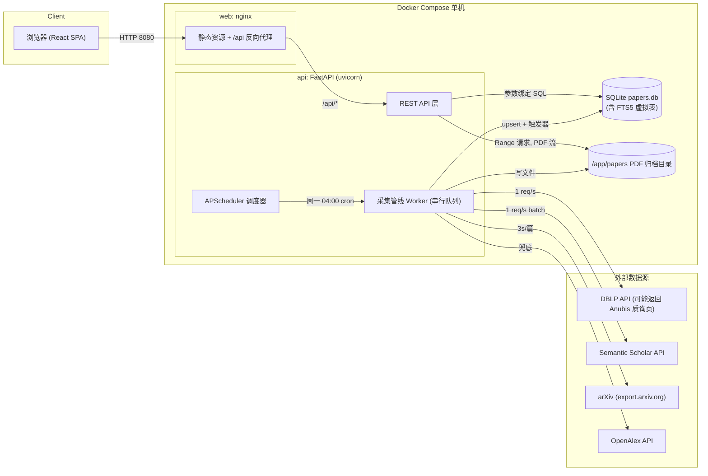
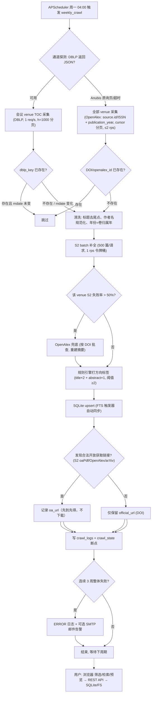
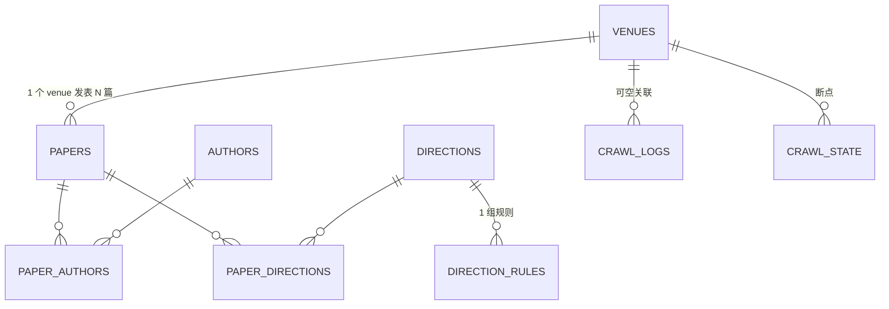

# 论文聚合追踪系统 · 系统设计方案

> 版本 v1.5（2026-09-20：研究工作台界面改版，§4.5 与统计契约同步；默认链接模式、每周采集保持不变）· 适用范围：个人自用单机部署 · 技术基线：FastAPI + SQLite(FTS5) + React/Vite + Docker Compose

> 当前界面与验收范围见 [界面改版与验收.md](界面改版与验收.md)。本文部分早期采集方案仍是历史设计，不构成已完成全目录覆盖的证明；正式发表归属及目录级别以官方来源核对为准。

---

## 0. 设计假设（边界情况集中声明）

以下假设一经确认，正文不再重复论证；任何假设变更需同步修改对应模块。

| # | 假设 | 理由 |
|---|---|---|
| A1 | 宿主机时区为 Asia/Shanghai，所有调度与时间戳（UTC 存储、展示转换）以此为基准 | 单机自用，统一时区避免 cron 歧义 |
| A2 | CCF 第七版目录**不爬取**，由开发者从官方公示稿人工整理为 `seeds/venues.csv` 一次性导入；后续增改只改 CSV，不改代码 | 目录一年一版，爬取公示页反而不稳 |
| A3 | 论文主源由**通道探测**动态决定（见 4.1）：会议 venue 在 DBLP 可达时用 DBLP TOC（`toc:` 查询）；DBLP 被反爬质询拦截（2026-09-18 实测 dblp.org 与镜像 dblp.uni-trier.de 对**所有** UA 返回 Anubis 质询页，即当前状态）时全量切换 OpenAlex（`source.id`/ISSN + `publication_year` 过滤）；期刊固定用 OpenAlex（DBLP 期刊按卷不按年，无法按年切片） | 外部通道可用性是动态事实，设计必须以"每周期探测"而非"假设可用"为前提 |
| A4 | **链接模式（默认，v1.3）**：不下载/存档 PDF，`oa_url`（S2 openAccessPdf / OpenAlex best_oa_location / arXiv 直链，任意合法域）与 `official_url`（DOI）仅记录展示，每周二 06:30 定时回填直至覆盖完整；`PDF_DOWNLOAD_ENABLED=true` 恢复下载模式——此时 PDF 仅从出版方/主办方认可的 OA 白名单渠道下载（arXiv、ACL Anthology、CVF、OpenReview、PMLR 等），付费墙域名永不入白名单，不使用盗版镜像；全渠道均无合法 PDF 才判 `closed` | 全量存档 PDF 会使存储膨胀（万级×2MB），个人使用得不偿失；链接模式下每篇论文仍可达全文，版权边界反而更简单（只外链、不分发文件） |
| A5 | arXiv 不产生论文记录，仅补 PDF；OpenAlex 可产生记录（`papers.source='openalex'`），通过 DOI 与既有 DBLP 记录归并（见 4.2 去重规则） | arXiv 单源入库消除"预印本 vs 正式版"重复；OpenAlex 记录仅在 DBLP 通道不可用时产生，DOI 归并防双条目 |
| A6 | 摘要可能缺失（S2 无数据/限流），缺失时 `abstract=NULL`，前端显示"暂无摘要" | 不阻塞入库，后续周期自动补 |
| A7 | FTS5 分词器 `porter unicode61` 面向英文；中文标题按整段分词，**中文全文检索不在 P0 范围**（筛选与列表检索不受影响） | 文献标题/摘要以英文为主， Porter 词干化对英文收益最大 |
| A8 | 单机单用户、无鉴权，端口绑定 `127.0.0.1`；数据量预估 ≤5 万条元数据、≤3 万个 PDF（≤60 GB） | 决定 SQLite 而非 PG、决定无缓存层 |
| A9 | 已入库论文不自动删除；规则重跑只增改规则标签，**不覆盖人工标签**（`source='manual'` 优先） | 防止自动化破坏人工整理成果 |
| A10 | 一篇论文的 PDF 只存一份，落在得分最高的方向目录；跨方向靠标签筛选，不做多副本 | 节省磁盘、避免副本不一致 |
| A11 | Semantic Scholar 官方限速：有 key 1 RPS（2026-09 官网确认），无 key 为 1000 RPS 共享池（实际不稳，按 0.5 RPS 保守限速）；batch 接口实测无 key 可用；"整批 ID 均无法解析"时 S2 返回 400 `No valid paper ids given`（语义为"全部未知"，系统按全 None 处理，不重试）。元数据补全（500 篇/请求）在限速内约 1 小时量级；OA 链接回填瓶颈在 OpenAlex 每日预算，由每周二 06:30 的 `links_backfill` 分批消化 | 免费 key 是官方推荐用法；S2 400 语义实测确认（2026-09-19） |
| A12 | 会议年份以 DBLP 卷归属年为准（NeurIPS 2024 = year 2024），arXiv 首发年不参与筛选 | 筛选语义是"某届会议的论文" |
| A13 | 默认 venue 种子共 28 个（见 4.2 表），**以 `venues.csv` 为唯一事实来源**，表中级别为按第七版公示稿整理的初始值，修正只改 CSV | 数据与代码解耦 |

---

## 1. 项目概述

### 1.1 背景

个人研究者在人工智能（LLM、投机解码、智能体）方向需要持续跟进 CCF A/B 类顶会顶刊的最新论文，但 DBLP、Semantic Scholar、arXiv 分散且无方向级聚合视图，人工每周翻阅成本高、易遗漏。本项目构建一个自托管的论文聚合追踪应用：每周自动从 DBLP 拉取目标 venue 论文，用 Semantic Scholar 补全摘要与 OA 信息，把 OA 论文的 PDF 归档到本地目录，并提供按方向/级别/会议/年份筛选与全文检索的 Web 界面。

### 1.2 量化目标

- 覆盖 **28 个默认 CCF A/B 类 venue**（8 个 A 类会议、10 个 B 类会议、4 个 A 类期刊、6 个 B 类期刊，见 4.2；CSV 可扩展至 AI 全领域约 70 个）；
- **每周一 04:00 自动增量更新**，单次增量处理 ≤1500 篇新论文，元数据 ≤3 小时入库；OA 链接随元数据同批写入，存量缺口由每周二 06:30 的 `links_backfill` 补齐（OpenAlex 每日预算内分批，数周内覆盖率收敛至 ~90%）；
- 支持 **5 种筛选维度**：细粒度方向（4 个）、CCF 级别（A/B）、会议/期刊（28+）、年份（2023–当前）、OA 状态（有 PDF/需跳转），外加全文检索；
- 冷启动回填 2023–2025 三个年度，预计 2–4 万条元数据、1–2 万个 OA PDF；
- 列表/详情接口 P95 < 300 ms，全文检索 P95 < 500 ms（按 5 万条规模）。

### 1.3 目标用户

**仅本人（个人研究者）**：单用户、无登录鉴权、无多角色；浏览器为本机 Chrome/Edge 最新版。

### 1.4 功能范围

**做什么：**

1. F1 每周自动采集 28 个目标 venue 近两年 + 冷启动近三年的论文元数据（DBLP 单源）；
2. F2 自动补全摘要、引用数、DOI、arXiv ID、OA PDF 链接（S2 → OpenAlex 兜底）；
3. F3 自动方向归类：CCF 领域粗粒度（人工智能）+ 规则引擎细粒度标签（LLM / Speculative Decoding / Agent），支持一稿多标；
4. F4 链接可达（默认）：入库即为每篇论文记录 `oa_url`（S2 openAccessPdf / OpenAlex best_oa_location / arXiv 直链三源，先到先得）与 `official_url`（DOI），详情页两级降级展示——开放版本外链 → DOI 官方链接；`PDF_DOWNLOAD_ENABLED=true` 时切换为下载模式（白名单多渠道下载 + 归档，见 4.1）；
5. F5 Web 界面：首页方向卡片流、列表筛选（方向/级别/会议/年份/OA）、详情页、PDF.js 在线预览与下载；
6. F6 FTS5 全文检索（标题+摘要，英文）；
7. F7 采集日志、断点续传、连续失败告警（日志 + 可选邮件）；
8. F8 闭源论文展示完整元数据 + DOI/官方链接跳转按钮，永不抓取其 PDF。

**不做什么：**

1. 不做用户系统/权限/评论/收藏夹同步（本地自用）；
2. 不追踪作者主页、机构、引用网络、学术新闻；
3. 不爬取出版社官网（IEEE/ACM/Springer/Elsevier），闭源论文一律跳转；
4. 不做推荐算法、个性化订阅推送；
5. 不做移动端适配（桌面浏览器优先，响应式为 P2）；
6. 不做 PostgreSQL/分布式部署的现网支持（仅预留，见 5.1 理由）。

---

## 2. 需求分析

### 2.1 功能需求清单

| 编号 | 需求 | 优先级 | 验收口径 |
|---|---|---|---|
| F-001 | DBLP venue 论文列表采集（TOC 接口，分页） | P0 | 任选 venue 可拉全指定年份全部条目 |
| F-002 | 元数据补全（摘要/引用/DOI/arXivID/OA 链接，S2 batch + OpenAlex 兜底） | P0 | 新论文 48h 内摘要覆盖率 ≥85% |
| F-003 | 去重与幂等入库（dblp_key 唯一，重复执行不产生重复行） | P0 | 同一任务重跑两次，行数不变 |
| F-004 | 方向归类（venue→人工智能粗粒度；关键词规则→细粒度多标签） | P0 | 规则集对人工标注 50 篇样本准确率 ≥80% |
| F-005 | 链接模式（默认）：入库即记录 `oa_url`（S2/OpenAlex/arXiv 三源）与 `official_url`；下载模式（开关打开）时才执行多渠道白名单下载 | P0 | 每篇论文详情页均可见可达的全文/官方链接 |
| F-006 | 论文列表：方向/级别/会议/年份/OA 组合筛选 + 分页排序 | P0 | 全部维度可组合，P95<300ms |
| F-007 | 论文详情：元数据 + 摘要 + 作者列表 + 状态 | P0 | 404 有标准错误体 |
| F-008 | PDF 在线预览（PDF.js + Range 流式）与下载 | P1（仅下载模式启用；链接模式下详情页为两级外链，无本地 PDF 可预览） | 下载模式下 500 页 PDF 首屏 <3s，可拖动跳页 |
| F-009 | FTS5 全文检索（标题+摘要） | P0 | bm25 排序，支持多词 AND |
| F-010 | 统计接口（按方向/级别/年份/OA 计数） | P1 | 首页卡片数与列表一致 |
| F-011 | 手动触发采集（weekly/backfill 两种 scope） | P1 | 触发后状态接口可见 run_id |
| F-012 | 采集日志查询与状态查看 | P1 | 最近 10 次运行可翻页 |
| F-013 | 断点续传（venue×年份 粒度 checkpoint） | P1 | 回填中断后重跑不重复已完成单元 |
| F-014 | 失败告警（连续 3 周失败 → 日志 ERROR + 可选邮件） | P1 | 断网 3 次能收到告警（若配置邮件） |
| F-015 | 方向规则管理（增删改关键词/权重/阈值） | P2 | 改规则可一键重跑全量打标 |
| F-016 | Venue 映射管理（CRUD venues.csv 同步进库） | P2 | 新增 venue 下一周期生效 |
| F-017 | 论文人工校正（改标签、删除错误条目、方向审核队列） | P2 | 人工标签不被规则重跑覆盖 |
| F-018 | BibTeX/CSV 导出（当前筛选结果） | P2 | 1000 条导出 <5s |
| F-019 | 全文可达三级降级：内嵌 PDF（仅下载模式）→ 开放版本外链（`oa_url`）→ DOI 官方链接 | P0 | 详情页对应状态均可见且按钮可用 |
| F-020 | venue/年份归属正确性审计（S2 `externalIds.DBLP` 权威确认 + `venue_confirmed` 标记 + 抽样） | P1 | 抽样 100 篇归属正确率 ≥98% |
| F-021 | 时效性展示：每周采集一次，页面显示真实下次运行时间、数据快照时间与来源缺口；旧周四加跑取消 | P1 | `crawl/status.schedule` 对应实际注册任务，界面不将本地刷新说成外部实时采集 |
| F-022 | 引用数分级刷新（近 2 年论文每周、其余每月） | P2 | `citation_count` 与 S2 抽样一致 |

### 2.2 非功能需求

| 类别 | 指标 |
|---|---|
| 性能 | 列表/详情 P95 < 300 ms；FTS 检索 P95 < 500 ms；PDF 首字节 < 200 ms（本地盘）；前端首屏 < 2 s |
| 可靠性 | 外部 HTTP 请求失败自动重试 3 次（指数退避 `2^n×2s`，上限 120 s，含抖动）；单 venue 失败不阻塞其他 venue；整个采集任务连续失败 3 个周期触发告警；所有入库为幂等 upsert，任务可任意重跑 |
| 限速合规 | DBLP ≤1 req/s（每周期先探测通道可用性）；S2 有 key 1 RPS、无 key 0.5 RPS；PDF 下载 ≥3 s/篇、并发 1、带标识 User-Agent、目标域仅限 `pdf_whitelist`；OpenAlex ≤2 req/s 且遵守预算/积分制（带 mailto，预算耗尽暂停至 UTC 午夜重置） |
| 安全 | 采集器仅请求 https 且域名白名单，DNS 解析结果拒绝私网/环回/保留地址（SSRF 防护）；`papers.pdf_path` 服务前必须 `resolve()` 后位于 `PAPERS_ROOT` 内（防路径穿越）；SQL 全参数绑定；凭据仅环境变量；容器非 root + `no-new-privileges`（详见 6.4） |
| 版权合规 | 仅 arXiv 渠道下载 PDF（A4）；闭源论文 `pdf_status='closed'`，接口层禁止返回任何 PDF 流；导出/日志中不包含出版社付费内容 |
| 可维护性 | 全部配置走环境变量；数据库迁移用 SQLAlchemy + Alembic（SQLite→PG 仅换连接串与方言，SQL 均经 ORM/参数绑定） |

---

## 3. 总体架构

### 3.1 系统架构图



### 3.2 数据流图



### 3.3 技术选型理由

| 选型 | 理由（为什么是它而不是替代方案） |
|---|---|
| FastAPI | 原生 async + 自动 OpenAPI 文档与 Pydantic 校验；Flask 需手工拼校验与文档，Django 过重 |
| SQLite + FTS5 | 零运维单文件数据库，5 万条内 FTS5 检索毫秒级；MySQL/PG 需额外容器与运维，个人规模收益为零 |
| SQLAlchemy 2.0 + Alembic | 所有 SQL 走 ORM 与参数绑定（防注入），迁移可版本化；PG 升级只需换连接串与 `sqlite://` → `postgresql://` 方言差异点集中在 FTS（见 5.1） |
| React + Vite | Vite 开发热更新秒级、构建产物为纯静态由 nginx 托管；Next.js 的 SSR 对本地单用户无意义 |
| PDF.js (react-pdf 封装) | 纯前端渲染无需后端转码，配合后端 Range 支持实现大文件渐进加载；服务端转图片方案浪费 CPU 且无法复制文本 |
| httpx (async) + tenacity | 连接池复用 + 声明式重试策略；requests 不支持 async 且重试要手写 |
| APScheduler (AsyncIOScheduler) | 进程内 cron 调度零额外组件；Celery+Redis 为一个每周任务引入两个容器不成比例 |
| DBLP 会议主源 + OpenAlex 运行时主备 | DBLP TOC 语义精确、`@key` 全局唯一，但官方接口当前部署 Anubis 反爬质询（2026-09 实测 dblp.org 与镜像对所有 UA 返回质询页），故按周期探测动态切换 OpenAlex（`source.id` 稳定、原生按年过滤）；S2 搜索接口排序不稳定，只作字段补全 |
| nginx 前置 | 同源托管 SPA 与反代 /api，规避 CORS；FastAPI StaticFiles 方案无法 gzip/缓存静态资源 |

---

## 4. 模块详细设计

### 4.1 采集模块

**调度策略**

- 运行形态：`uvicorn papers.api:app --workers 1`，**必须单 worker 且禁用 `--reload`**。理由：APScheduler 随应用进程启动，多 worker 会产生多个调度器实例导致重复采集。
- APScheduler `AsyncIOScheduler`，timezone `Asia/Shanghai`：
  - `weekly_crawl`：`CronTrigger(day_of_week='mon', hour=4, minute=0)`，`max_instances=1`、`coalesce=True`、`misfire_grace_time=86400`（容器错峰启动后仍会补跑一次）；
  - `pdf_backlog`：`CronTrigger(hour=5, minute=0)`，**仅下载模式注册**（扫描 `pdf_status IN ('pending','failed')` 补下载，每日上限 5000 篇）；链接模式下不注册该任务，改注册 `links_backfill`（每周二 06:30，见下）；
  - `links_backlog` 不存在——链接模式的存量补齐由 `links_backfill` 承担：`CronTrigger(day_of_week='tue', hour=6, minute=30)`，紧跟周一采集，用当日 OpenAlex 预算批量补 `oa_url`（50 篇/请求），预算耗尽自动停止、下周继续，直至覆盖完整（幂等可重跑）；
  - 旧 `weekly_crawl_peak` 已取消；外部论文增量只保留每周一一次。所有 CronTrigger 显式指定 `Asia/Shanghai`，避免容器宿主机时区影响；
  - `monthly_metrics`：`CronTrigger(day='1', hour=6)`，刷新 2023 年后全部论文的 `citation_count`（S2 batch）并输出收录滞后统计。
- 任务队列：进程内 `asyncio.Queue`，单 worker 串行消费 venue 级任务；**并发控制 = 三级令牌桶**：DBLP 1 req/s、S2 1 RPS（无 key 0.5）、arXiv 1 req/3s。理由：外部限速是硬约束，本地并发只会换来自封禁，串行 + 令牌桶最简单可控。

**通道探测与主备切换**

- 每轮 `weekly_crawl` 与 `backfill` 开始时向 `{DBLP_BASE_URL}/search/publ/api?q=toc:db/conf/nips/nips2024.bht:&h=1&format=json` 发一次探测请求：响应 `Content-Type: application/json` 且含 `hits` 字段 → DBLP 通道可用；响应为 HTML 质询页（含 `/.within.website` 标记或标题 `Making sure you're not a bot!`）→ 本轮标记 DBLP offline。`DBLP_BASE_URL` 为环境变量（默认 `https://dblp.org`），官方放开限制或给出可用镜像时改一个变量即回切。
- 离线时的采集映射：会议 venue → OpenAlex `primary_location.source.id:{openalex_source_id}` + `publication_year`；期刊 venue → OpenAlex `primary_location.source.issn:{issn}` + `publication_year`。记录以 `source='openalex'` 入库，经 DOI / S2 `externalIds.DBLP` 与既有 DBLP 记录归并。
- **S2 bulk 兜底通道**（低产单元自动追加）：OpenAlex 对部分会议卷覆盖不足（实测 ICLR 2025 全卷仅挂 arXiv 版，按 venue 过滤只采到 3 篇）。当 conf 单元产量 < `OPENALEX_LOW_YIELD`（默认 20）且 venue 配置了 `s2_venue` 时，调用 S2 bulk search（`venue` + `year` 过滤，token 翻页，方向偏置宽查询 `S2_BULK_QUERY` 可配），仅收 `externalIds.DBLP` 前缀匹配本 venue 的记录——记录以 `source='dblp'` 生成（DBLP key 即权威归属），复用既有入库/打标/PDF 流水线，无新增 schema。实测 ICML 2025：3→318 篇，ICLR 2025：3→230 篇。
- 探测结果与切换决策写入 `crawl_logs.error` 字段（如 `dblp=anubis_challenge, fallback=openalex`）。理由：不实现质询绕过（绕过反爬控制脆弱且不合规），用"探测—切换—自动恢复"把外部通道的不确定性变成可观测的正常分支。

**增量更新机制**

- DBLP 通道：每条记录带全局唯一 `@key`（如 `conf/nips/zhao2024fast`）与修改时间 `@mdate`。`dblp_key` 不存在 → 新论文入库；`dblp_key` 存在且 `mdate` 变化 → 更新 DBLP 侧字段并置 `enriched_at=NULL` 触发重新补全；否则跳过。周增量扫描范围 = 每个 active 会议 venue 的 `{当前年, 上一年}` 两个 TOC（覆盖跨年补录）。
- OpenAlex 通道：过滤条件加 `from_updated_date:{上次成功采集日}`（OpenAlex 官方过滤字段，`YYYY-MM-DD`）；`openalex_id` 不存在 → 新论文入库，存在 → 比较 `updated_date` 决定是否刷新。理由：两通道各自使用其原生稳定标识（`dblp_key` / `openalex_id`）判定增量，无需自造"自增 ID 比对"。

**API 限速与重试**

| 数据源 | 端点 | 限速 | 重试与失败语义 |
|---|---|---|---|
| DBLP（探测可用时，会议） | `GET {DBLP_BASE_URL}/search/publ/api?q=toc:db/{stream}/{toc_key}.bht:&h=1000&f={offset}&format=json`，`{toc_key}` 由 `venues.dblp_toc_pattern`（如 `nips{year}`）代入生成 | 1 req/s | tenacity 3 次，指数退避 2^n×2s+抖动，遵循 `Retry-After`；响应为 HTML 质询页视为**通道级故障**：标记本轮 DBLP offline 并整体切换 OpenAlex，不做质询绕过 |
| OpenAlex（主备源） | `GET https://api.openalex.org/works?filter=primary_location.source.id:{id},publication_year:{y},from_updated_date:{date}&cursor=*&per-page=200&mailto={CONTACT_EMAIL}`（期刊用 `primary_location.source.issn:{issn}`） | ≤2 req/s；OpenAlex 2026 起为预算/积分制（实测每日配额、UTC 午夜重置），预算耗尽 → 本通道暂停写 WARNING，次日自动恢复 | cursor 分页至 `meta.next_cursor=null`；429/预算错误不重试，直接休眠至次日 |
| S2（补全） | `POST https://api.semanticscholar.org/graph/v1/paper/batch?fields=title,abstract,externalIds,citationCount,isOpenAccess,openAccessPdf,year,authors`，body 为 ≤500 个 `DBLP:...`/`DOI:...`/`ArXiv:...` ID（无 key 实测可用） | 令牌桶 1 RPS（有 key，官方档）/ 0.5 RPS（无 key） | 429/5xx 重试 5 次，退避基数 5s、上限 300s；连续 3 次限流则休眠 10 min |
| arXiv（PDF） | `GET https://export.arxiv.org/pdf/{arxiv_id}`，UA=`PaperTracker/{version} (mailto:{CONTACT_EMAIL})` | 3 s/篇、并发 1 | 2 次；下载后校验 `%PDF` 魔数与 `Content-Type`；目标 URL 仅接受白名单域（见 6.4） |

- S2 批量补全：新论文按 500 篇/请求分批（3 万条 ≈ 60 请求，1 RPS 下约 1 分钟量级）；单 venue 失败率 >50% 时该 venue 的补全切换 OpenAlex，从 `abstract_inverted_index` 重建摘要。补全返回的 `externalIds.DBLP` 用于把 OpenAlex 来源记录归并回 DBLP key 并**权威确认 venue/年份**（见 4.2），`externalIds.ArXiv` 用于确定 PDF 候选。

**全文链接策略（默认链接模式，F-005/F-019 核心）**

- **链接三源记录（不下载）**：入库与补全阶段把 ① S2 `openAccessPdf.url`、② OpenAlex `best_oa_location.pdf_url` / `open_access.oa_url`、③ 已知 `arxiv_id` 时构造的 `https://arxiv.org/abs/{id}` 写入 `papers.oa_url`——统一经 `set_oa_url_if_empty()`（enrichment 服务唯一写入口，先到先得不覆盖）。`official_url`（DOI，无 DOI 时 DBLP 记录页）始终非空。理由：个人自用场景下全量存档 PDF 使磁盘/备份膨胀（万级 × ~2MB），而链接模式零存储成本且每篇论文仍一步可达全文；版权边界也更简单——只外链、不分发文件。
- **存量自愈（`links_backfill`，每周二 06:30）**：arXiv 直链零 API 构造；其余按 `openalex_id` 批量（50 篇/请求）取 best OA；OpenAlex 预算耗尽自动停止、下周继续（幂等）。新周期采集的论文链接随元数据同批写入，无需回填。
- **可选下载模式（`PDF_DOWNLOAD_ENABLED=true`）**：恢复 6.1 的白名单多渠道下载器（候选链 + 主机熔断 + SSRF 校验 + `.part` 原子写 + 归档目录），`pdf_backlog` 每日 05:00 注册。白名单不变（下表），**付费墙域名永不入白名单，不存在任何绕过付费墙的路径**；白名单外链接始终只进 `oa_url` 展示。链接模式下 `pdf_whitelist` 表与下载器代码保留但休眠，保证开关切换零改造。

| host（下载模式白名单，种子 `seeds/pdf_whitelist.csv`） | 覆盖 | 说明 |
|---|---|---|
| arxiv.org / export.arxiv.org | 全部 | 预印本自存档，优先级最高（稳定、有版本历史） |
| proceedings.neurips.cc / papers.nips.cc | NeurIPS | 官方论文集，全量 OA（2026-09 实测本网络不可达，靠候选链降级到 OpenReview/arXiv） |
| proceedings.mlr.press | ICML/UAI/AISTATS | PMLR 官方，全量 OA |
| openreview.net | ICLR（及 NeurIPS/ICML 投稿页） | 官方系统 PDF |
| aclanthology.org | ACL/EMNLP/COLING/CoNLL/TACL | 官方库，全量 OA |
| openaccess.thecvf.com | CVPR/ICCV/ECCV | CVF 官方库，全量 OA |
| ojs.aaai.org | AAAI/ICAPS/KR | 官方 OJS，OA |
| ijcai.org | IJCAI | 官方论文集，OA |
| jmlr.org / jmlr.csail.mit.edu | JMLR | 官方，全量 OA |

- 链接覆盖率预期：会议论文几乎全部有主办方 OA 版本，期刊中 JMLR/TACL/CL 全量 OA、TPAMI 等依赖 arXiv 预印本 → 整体可达 ~90%（含仅 DOI 的 ~10% 闭源论文）。

**失败告警**

- 每次运行写一条 `crawl_logs`（run_id、状态、计数、错误摘要）；`weekly_crawl` 结束后检查**最近 3 条 weekly 运行**是否全部 `failed`：是 → 记 ERROR 日志并（若 `SMTP_HOST/SMTP_PORT/SMTP_USER/SMTP_PASS/ALERT_EMAIL` 五个环境变量齐全）用 `smtplib` 发送主题 `[PaperTracker] 采集连续失败 3 次` 的邮件；未配置邮件则仅日志告警。理由：个人系统优先零依赖日志，邮件作为可选增强而非必需件。
- **收录滞后监控（F-021）**：`weekly_crawl` 结束时统计近 90 天入库论文的 `publication_date` 到入库时间的中位滞后，>21 天写 WARNING（提示上游收录延迟或通道异常），连续两个周期超阈值升级为告警邮件。理由：时效性不能只靠"跑得勤"，必须可度量、可告警。

### 4.2 数据处理模块

**Venue 名称映射（初始化即人工核对）**

映射不靠运行时模糊匹配，而是一份人工核对过的种子 CSV（`seeds/venues.csv`，字段：`abbr,name,dblp_stream,dblp_toc_pattern,type,issn,openalex_source_id,ccf_level,ccf_area,active`），启动时 upsert 进 `venues` 表。`dblp_toc_pattern` 是各会议在 DBLP 的 TOC 命名模板（如 NeurIPS 为 `nips{year}`、ACL 为 `acl{year}`），消除"缩写≠卷名"的猜测；`openalex_source_id` 与 `issn` 由初始化脚本按 venue 名称调用 `https://api.openalex.org/sources?search={name}` 辅助检索后**人工确认**写入。DBLP 通道可用时校验 `https://dblp.org/db/{stream}/` 可访问，不可访问仅记 WARNING（Anubis 质询属通道级问题，不作为单 venue 失效依据）。理由：venue 集合一年一变，静态人工核对比运行时字符串匹配可靠一个量级；通道级故障不应误停单 venue。

默认种子（28 个，级别以第七版公示稿整理，修正只改 CSV）：

| abbr | dblp_stream | type | 级别 | abbr | dblp_stream | type | 级别 |
|---|---|---|---|---|---|---|---|
| AAAI | conf/aaai | conf | A | ECCV | conf/eccv | conf | B |
| NeurIPS | conf/nips | conf | A | ECAI | conf/ecai | conf | B |
| ICML | conf/icml | conf | A | AAMAS | conf/amas | conf | B |
| ICLR | conf/iclr | conf | A | UAI | conf/uai | conf | B |
| ACL | conf/acl | conf | A | ICAPS | conf/icaps | conf | B |
| CVPR | conf/cvpr | conf | A | KR | conf/kr | conf | B |
| ICCV | conf/iccv | conf | A | ECML-PKDD | conf/ecml | conf | B |
| IJCAI | conf/ijcai | conf | A | ICRA | conf/icra | conf | B |
| EMNLP | conf/emnlp | conf | B | AI | journals/ai | journal | A |
| COLING | conf/coling | conf | B | TPAMI | journals/pami | journal | A |
| IJCV | journals/ijcv | journal | A | JMLR | journals/jmlr | journal | A |
| JAIR | journals/jair | journal | B | TACL | journals/tacl | journal | B |
| CL | journals/cl | journal | B | TASLP | journals/taslp | journal | B |
| TNNLS | journals/tnn | journal | B | PR | journals/pr | journal | B |

**去重规则（按序执行）**

1. `dblp_key` UNIQUE：同一 DBLP 记录 upsert 幂等（主防线，A5 单源入库使预印本重复不存在）；
2. `doi` 规范化（lowercase、去 `https://doi.org/` 前缀）后 UNIQUE，并作为**跨源归并键**：新记录（含 OpenAlex 来源）的 DOI 与已有记录相同 → 补充字段而非新建行；会议版/期刊扩展版 DOI 本就不同，天然两条记录，符合学术惯例；
3. `arxiv_id`、`s2_id` 分别 UNIQUE（S2 会把 DBLP key 作为 externalId 返回，直接可查）；
4. 标题模糊匹配（norm title 相等或归一化编辑距离 ≥0.95）**只用于一处**：PDF 下载前校验 arXiv 论文与 DBLP 记录确为同一篇；不匹配则放弃下载置 `pdf_status='failed'`。理由：模糊匹配误合并代价高，把它限制在校验场景，宁可少下载不可错合并。

**方向归类策略**

- 粗粒度：入库时按 `venue.ccf_area` 写入 papers 冗余列 `ccf_area`（默认"人工智能"），不建粗粒度方向行，避免与细粒度标签混淆。
- 细粒度规则存 `direction_rules` 表（`direction_id, keyword, field, weight, enabled`），`keyword` 为**大小写不敏感的正则**；打标分数 = title 命中数×2×weight + abstract 命中数×1×weight；`score ≥ directions.min_score` 即写入 `paper_directions`。默认规则（可增删，改后经 F-015 重跑全量打标）：

| direction (code) | min_score | keyword（正则） | weight |
|---|---|---|---|
| llm | 2 | `large language models?` / `\bllms?\b` / `\bgpt(-?\d|\b)` / `\bllama\b` / `instruction tun(ing|ed)` | 1.0 |
| specdec | 2 | `speculative (decoding|sampling|inference)` / `draft model` / `self-speculative` | 1.0 |
| agent | 2 | `multi-?agents?` / `autonomous agents?` / `llm agents?` / `\bagentic\b` / `\btool (use|calling)\b` / `\bagents?\b`（低权重泛词） | 1.0；泛词 `\bagents?\b` 为 0.5（单次泛词命中 0.5<2，需与其它词共现，抑制 "user agent" 类误报） |

- 多方向共存：`paper_directions(paper_id, direction_id)` 多对多，附 `score, source('rule'|'manual')`；归档目录取 `score` 最高者（同分取 direction_id 小者），目录落定在 PDF 下载时一次计算，此后不随标签变动搬移文件（A10）。
- 规则更新：P0 用 CSV/SQL 直改表，P2 提供管理界面（F-015）+ "重跑打标"按钮（仅重算 `source='rule'` 行）。

**数据清洗**

- 作者名：DBLP 给出 `Given Surname` 形式，规范化存储 `name='Surname, Given'`、`name_norm=NFKD 去变音符+lowercase`（作为 authors 唯一键）；仅存姓名不存 ID（不做作者追踪）。
- 年份对齐：`paper.year = DBLP TOC 卷归属年`（A12），与 arXiv 首发年脱钩。
- **venue/年份归属权威源（OpenAlex 通道正确性核心，F-020）**：OpenAlex 会议论文的 `primary_location` 常指向其 arXiv 版本（source=CoRR），直接取用会把 venue 记成 arXiv、年份记成预印本年。规则：优先用 S2 补全返回的 `externalIds.DBLP`（stream 前缀 + key 中的年份段即权威 venue/年份），命中置 `venue_confirmed=1`；未命中（论文确未进 DBLP 卷，如 workshop 或刚上线的卷）才回退 OpenAlex `primary_location` 并置 `venue_confirmed=0`；DBLP 通道恢复后的下个周期重扫对应年份 TOC，按 DOI upsert 自动补 `dblp_key` 并翻转为 confirmed。
- 标题：去除 DBLP 标题尾部的句点；保留 LaTeX/Unicode 原文，另存 `title_norm`（lowercase、去标点空白）用于模糊匹配。
- 摘要：S2/OpenAlex 原文存储，缺失置 NULL（A6）。

### 4.3 存储设计（本地目录，仅下载模式使用）

> 链接模式（默认）下 `papers/` 目录为空、不产生任何文件写入；本节结构在 `PDF_DOWNLOAD_ENABLED=true` 时生效。

```text
papers/                          # 容器内 /app/papers，宿主机 ./papers 挂载
  LLM/                           # {研究方向 code}：得分最高方向；无标签→"uncategorized"
    NeurIPS/                     # {venue abbr}
      2024/                      # {年份}
        000123_fast-token-leve.pdf   # {论文自增ID:06d}_{标题slug前20字符}.pdf
  Agent/
    ACL/
      2025/
        001204_tool-learning-age.pdf
```

- **论文 ID 用数据库自增 ID**，不用 DBLP key。理由：DBLP key 含 `/`、`:` 等文件系统不安全字符且跨平台大小写敏感问题多；自增 ID 全局唯一、定长零填充、排序友好；DBLP key 仍存于 `papers.dblp_key` 供溯源。
- **特殊字符处理（slug 规则）**：标题 → NFKD 转_ascii → lowercase → 非 `[a-z0-9]` 连续段替换为 `-` → 合并多个 `-` → 去首尾 `-` → 截前 20 字符 → 再去尾 `-`；结果为空（如纯中文标题）则用 `paper`。全路径字符集限定 `[a-z0-9-]`，Windows/Linux 双平台安全。
- 目录结构是**归档视图**：`papers.pdf_path` 存相对路径且为唯一权威索引；标签变更不搬文件（A10）。理由：搬移文件会破坏外部符号链接与备份增量。下载写入使用 `{filename}.part` 临时名、完成后 `os.rename` 原子改名——备份（7.2）永不复制到半成品文件。

### 4.4 后端 API

统一约定：前缀 `/api`；分页参数 `page`（≥1，默认 1）、`size`（1–100，默认 20）；时间戳 ISO8601 UTC；错误体统一 `{"error": {"code": "<CODE>", "message": "<人读描述>"}}`；所有查询参数经 Pydantic 校验，SQL 全部参数绑定。

| 方法 | 路径 | 功能 | 请求参数 | 响应示例（截断） | 错误码 |
|---|---|---|---|---|---|
| GET | /api/papers | 论文列表（组合筛选） | `direction=llm&level=A&venue=NeurIPS&year=2024&pdf_status=downloaded&sort=year_desc\|citation_desc\|created_desc&page=1&size=20` | `{"total":1428,"page":1,"size":20,"items":[{"id":123,"title":"...","venue":"NeurIPS","level":"A","year":2024,"directions":["llm","specdec"],"citation_count":57,"pdf_status":"downloaded","doi":"10.5555/..."}]}` | 400 INVALID_PARAM |
| POST | /api/papers | 手工补录论文（P2） | body: `{"title":"...","venue_abbr":"NeurIPS","year":2024,"doi":"...","dblp_key":"..."}` | `201` `{"id":1301}`，带 `Location: /api/papers/1301` 头 | 400 / 409 DUPLICATE |
| GET | /api/papers/{id} | 论文详情 | - | `{"id":123,"title":"...","title_norm":"...","abstract":"...","authors":[{"name":"Zhao, Adam","order":1}],"venue":{...},"directions":[...],"citation_count":57,"pdf_status":"downloaded","pdf_source":"arxiv","pdf_url":"/api/papers/123/pdf","oa_url":null,"official_url":"https://doi.org/...","venue_confirmed":1,"publication_date":"2024-12-01","arxiv_id":"2401.12345","created_at":"...","updated_at":"..."}` | 404 PAPER_NOT_FOUND |
| PATCH | /api/papers/{id} | 人工校正（方向标签/备注，P2） | body: `{"directions":["llm","agent"],"note":"..."}` | `{"id":123,"directions":["llm","agent"]}` | 400 / 404 |
| DELETE | /api/papers/{id} | 删除错误条目（P2，连带 PDF 文件） | - | `204` | 404 |
| GET | /api/papers/{id}/pdf | PDF 预览/下载（支持 Range） | `download=1` 时加 `Content-Disposition: attachment` | `200/206`，`application/pdf`，头 `Accept-Ranges: bytes`、`Content-Range: bytes 0-65535/2384712` | 404 PDF_NOT_FOUND（OA 但文件缺失或路径越界）/ 403 PDF_CLOSED（闭源，body 附 `official_url` 与 `oa_url`）/ 416 RANGE_NOT_SATISFIABLE（带 `Content-Range: bytes */size`）/ 404 PAPER_NOT_FOUND |
| GET | /api/search | 全文检索 | `q="token level"&direction=llm&level=A&year=2024&page=1&size=20` | 同列表项结构，附 `{"score": 3.41}`（bm25，越小越相关，前端升序） | 400 EMPTY_QUERY |
| GET | /api/directions | 方向列表 | - | `{"items":[{"code":"llm","name":"大语言模型","paper_count":4210}]}` | - |
| GET | /api/venues | 会议/期刊列表 | `direction=llm&level=A` | `{"items":[{"abbr":"NeurIPS","name":"Annual Conference on Neural Information Processing Systems","type":"conf","level":"A","paper_count":830}]}` | - |
| GET | /api/stats/overview | 统计 | - | `{"total":23456,"by_direction":{"llm":4210,"agent":3980,"specdec":312},"by_level":{"A":11200,"B":12256},"by_year":{"2023":6100,"2024":8200,"2025":9156},"pdf_archived":12800,"last_crawl_at":"2026-09-14T20:03:11Z"}` | - |
| POST | /api/crawl/trigger | 手动触发采集（P1） | body: `{"scope":"weekly"}` / `{"scope":"backfill","years":[2023,2024,2025]}` / `{"scope":"pdf"}`（手动补下 PDF，≤5000/天，pending+failed 均重试） | `202` `{"run_id":"c-20260918-041233"}` | 409 ALREADY_RUNNING |
| POST | /api/crawl/reclassify | 全量重打方向标签（P2，仅重算 `source='rule'` 行） | - | `202` `{"run_id":"r-20260918-041233"}` | 409 ALREADY_RUNNING |
| GET | /api/crawl/status | 当前运行状态（P1） | - | `{"running":true,"run_id":"c-...","current":"conf/nips/2026","progress":"12/56"}` | - |
| GET | /api/crawl/logs | 采集日志（P1） | `page=1&size=20` | `{"items":[{"run_id":"...","task_type":"weekly","status":"success","papers_new":312,"pdf_downloaded":188,"started_at":"...","finished_at":"...","error":null}]}` | - |
| GET/POST/PUT/DELETE | /api/rules | 方向规则 CRUD（P2） | body: `{"direction_code":"llm","keyword":"\\bmistral\\b","field":"both","weight":1.0,"enabled":true}` | 规则行 JSON；DELETE `204` | 400 / 404 |
| GET/POST/PUT/DELETE | /api/venues | Venue 管理（P2） | 同 `venues.csv` 字段 | venue 行 JSON | 400 / 409（stream 重复） |
| GET | /api/health | 健康检查 | - | `{"status":"ok","db":"ok","scheduler_last_run":"..."}` | 503（DB 不可达） |

- 403 PDF_CLOSED 响应体返回 `official_url`（DOI 官方链接）与 `oa_url`（若曾发现白名单外但合法的开放版本链接），前端据此渲染"跳转官方链接"或"开放版本外链"按钮。理由：把版权策略固化在接口层，未归档的 PDF 在任何客户端下都拿不到流，但合法展示路径全部保留（F-019 三级降级）。
- 统一错误信封由**全局 exception handler** 保证：注册 `RequestValidationError` / `HTTPException` / `Exception` 三个处理器，把 FastAPI 默认的 `{"detail": ...}` 覆盖为 `{"error": {"code", "message"}}`（校验错误附 `details[]` 字段级信息），500 返回固定文案不回堆栈。理由：FastAPI 默认错误体与本文档信封不一致，不覆盖会出现两套格式。
- 不做 `/api/v1` 版本前缀。理由：内部单人使用的 API 无版本共存需求，破坏性变更直接修改并同步前端。
- 列表与检索查询为**单条 SQL**：JOIN `venues` + LEFT JOIN 聚合 `paper_directions`（`GROUP_CONCAT` 方向 code）+ 子查询取前 3 作者，避免逐行查询的 N+1。

### 4.5 前端页面（v1.5 研究工作台）

技术栈：React 18、Vite 7、React Router 7、TanStack Query 5；CSS 变量提供深浅两套主题。图表使用可访问 SVG 加原生按钮，不依赖远程图片和图表服务。理由：本机访问快速、离线样式可用、键盘和触屏交互一致。详细数据契约与本次验收见《界面改版与验收.md》。

**页面 1 · 研究总览 `/`**
- 信息结构：论文数、配置来源数、研究方向数、开放链接覆盖率；A/B 年度柱状图、主题条形图、主题入口、最近收录、来源数量排名和覆盖提示。数字来自 `GET /api/stats/dashboard`，没有模拟统计。
- 交互：A/B 会议与期刊快捷切换 → 同范围重查统计；点击年份、主题、来源或开放链接占比 → 带参数进入 `/papers`。图表每 30 秒查询本地统计，不触发外部采集。理由：由总体数据自然过渡到可阅读的论文集合。

**页面 2 · 论文探索 `/papers`**
- 信息结构：左侧方向多选、年份、会议/期刊和开放链接筛选；右侧论文卡片，提供标题、前三作者、摘要预览、方向、来源/级别、年份、引用数、官方链接和归属提示。
- 交互：URL 为筛选的唯一已提交状态；英文输入 450ms 防抖，回车立即提交；`direction=llm,agent` 同维度 OR，其他维度 AND。支持相关性/最近收录/年份/引用数排序，10/20/50 条分页，舒适/紧凑视图。进入详情再返回保留筛选。理由：保证刷新、回退与复制 URL 后仍得到相同结果，不把 API 错误误报为空结果。

**页面 3 · 论文详情 `/papers/:id`**
- 信息结构：完整标题、作者、摘要、元数据、方向与数据来源说明；阅读区给出安全的官方链接和开放版本链接。无摘要或纯标点占位内容显示明确缺失提示。理由：不虚构摘要，也不把缺少 OA 链接等同于闭源结论。
- 交互：调用 `GET /api/papers/{id}`；原文链接新窗口打开；可复制引用文本；返回原列表参数。当前界面没有 PDF 预览/下载入口，旧可选组件不进入页面加载链。理由：遵守用户最新的链接模式决定。

**页面 4 · 会议与期刊 `/venues`**
- 信息结构：A/B 会议/期刊切换、缩写/全称检索、来源卡片、收录量和年度微型图。
- 交互：按本地收录量或名称排序；点来源卡片进入对应论文；零数据标为“暂未收录”，不推断“未召开”或“没有论文”。理由：来源覆盖与正式出版状态是不同事实。

**页面 5 · 采集管理 `/admin`**
- 信息结构：实际进程运行状态、调度器提供的下次运行时间、摘要/OA链接覆盖率、配置来源缺口、分页历史日志。
- 交互：用户显式点击才触发元数据同步，历史回填先显示确认提示；运行中每 3 秒读状态，空闲每 60 秒，结束后刷新相关本地查询。旧 running 日志若没有当前活跃任务，显示“未正常结束”，不冒充正在采集。理由：使控制页与真实运行状态一致，避免重复启动任务。

全局：`/` 快捷键聚焦全局检索，提供跳转主内容链接、可见焦点、减少动态效果支持；窄屏侧栏折叠，列表筛选可展开，卡片单列显示。可选深浅主题只保存到本机浏览器。理由：长时间研究阅读和手机访问均可用。

---

## 5. 数据库设计

### 5.1 ER 图



说明：作者表仅为论文作者列表的去重存储（A2 不追踪作者详情）；标签 = `directions`（细粒度方向即标签），粗粒度 CCF 领域为 `papers.ccf_area` 冗余列，不单独建表，理由：粗粒度取值只有一个且来自 venue，建表徒增一次 join。

### 5.2 表结构

**papers（论文主表）**

| 字段名 | 类型 | 约束 | 说明 |
|---|---|---|---|
| id | INTEGER | PRIMARY KEY AUTOINCREMENT | 论文唯一 ID，也是 PDF 文件名与 FTS rowid |
| dblp_key | TEXT | NULL UNIQUE | DBLP `@key`，如 `conf/nips/zhao2024fast`；`source='dblp'` 时非空（CHECK 约束见 source 行） |
| dblp_mdate | TEXT | NULL | DBLP `@mdate`，变更触发重新补全；OpenAlex 来源为 NULL |
| source | TEXT | NOT NULL DEFAULT 'dblp' | 记录来源通道（4.1 通道探测决定）或 `manual`（手工补录）；附**表级** CHECK：`CHECK(source IN ('dblp','openalex','manual') AND ((source='dblp' AND dblp_key IS NOT NULL) OR (source='openalex' AND openalex_id IS NOT NULL) OR (source='manual' AND (doi IS NOT NULL OR arxiv_id IS NOT NULL))))`——用表级而非列级 CHECK（列级引用其他列 PG 不兼容） |
| openalex_id | TEXT | NULL UNIQUE | OpenAlex ID 尾段（如 `W2105838763`）；`source='openalex'` 时非空，增量判定主键 |
| title | TEXT | NOT NULL | 原始标题（去尾部句点） |
| title_norm | TEXT | NOT NULL | 归一化标题（lowercase 去标点空白），模糊匹配用 |
| abstract | TEXT | NULL | 摘要，缺失 NULL |
| venue_id | INTEGER | NOT NULL REFERENCES venues(id) | 发表 venue |
| year | INTEGER | NOT NULL CHECK(year BETWEEN 2000 AND 2100) | 卷归属年（A12） |
| ccf_level | TEXT | NOT NULL CHECK(ccf_level IN ('A','B')) | 入库时从 venue 冗余，防 venue 级别后续调整影响历史筛选 |
| ccf_area | TEXT | NOT NULL DEFAULT '人工智能' | 粗粒度领域冗余列 |
| doi | TEXT | NULL UNIQUE | 规范化 DOI（lowercase，无前缀） |
| arxiv_id | TEXT | NULL UNIQUE | 如 `2401.12345` |
| s2_id | TEXT | NULL UNIQUE | Semantic Scholar corpusId |
| citation_count | INTEGER | NOT NULL DEFAULT 0 | 每周期随补全刷新 |
| pdf_status | TEXT | NOT NULL DEFAULT 'pending' CHECK(pdf_status IN ('pending','downloaded','failed','closed')) | closed=闭源/无 arXiv OA；failed=尝试下载失败 |
| pdf_path | TEXT | NULL | 相对 `papers/` 的路径，downloaded 时非空 |
| official_url | TEXT | NOT NULL | DOI 链接或 DBLP 链接，闭源跳转用 |
| publication_date | TEXT | NULL | ISO8601 日期（OpenAlex `publication_date`；DBLP 无精确日为 NULL），用于滞后监控（F-021）与展示 |
| pdf_source | TEXT | NULL CHECK(pdf_source IN ('arxiv','neurips','pmlr','openreview','anthology','cvf','aaai','ijcai','jmlr','other_oa')) | PDF 实际来源渠道，`downloaded` 时非空 |
| oa_url | TEXT | NULL | 白名单外但合法的开放版本链接（仅展示跳转，永不下载） |
| venue_confirmed | INTEGER | NOT NULL DEFAULT 0 | 1=venue/年份经 DBLP key 权威确认；0=OpenAlex 归属，待 DBLP 恢复后回填翻转（4.2） |
| note | TEXT | NULL | 人工备注（P2） |
| enriched_at | TEXT | NULL | 最近一次 S2/OpenAlex 补全时间，NULL 表示待补全 |
| created_at / updated_at | TEXT | NOT NULL | ISO8601 UTC，默认 `CURRENT_TIMESTAMP` |

索引：`(venue_id, year)`、`(year)`、`pdf_status`（partial：`WHERE pdf_status='pending'`）、`title_norm`、`created_at`（首页卡片流按入库时间倒序）。理由：覆盖 4.4 全部列表筛选组合。

**venues**

| 字段名 | 类型 | 约束 | 说明 |
|---|---|---|---|
| id | INTEGER | PRIMARY KEY AUTOINCREMENT | |
| abbr | TEXT | NOT NULL UNIQUE | 如 `NeurIPS`，目录名/API 参数 |
| name | TEXT | NOT NULL | CCF 全称，如 `Annual Conference on Neural Information Processing Systems` |
| dblp_stream | TEXT | NOT NULL UNIQUE | 如 `conf/nips` |
| dblp_toc_pattern | TEXT | NULL | DBLP TOC 命名模板（如 `nips{year}`）；conf 必填，journal 不用 |
| issn | TEXT | NULL UNIQUE | 期刊 ISSN（如 `0162-8828`）；journal 必填，OpenAlex 采集过滤键 |
| openalex_source_id | TEXT | NULL UNIQUE | OpenAlex Source ID（如 `S...`）；OpenAlex 通道过滤键，必填 |
| type | TEXT | NOT NULL CHECK(type IN ('conf','journal')) | |
| ccf_level | TEXT | NOT NULL CHECK(ccf_level IN ('A','B')) | |
| ccf_area | TEXT | NOT NULL DEFAULT '人工智能' | 粗粒度领域 |
| active | INTEGER | NOT NULL DEFAULT 1 | 0=停采（stream 校验失败或人工停用） |

**directions**

| 字段名 | 类型 | 约束 | 说明 |
|---|---|---|---|
| id | INTEGER | PRIMARY KEY AUTOINCREMENT | |
| code | TEXT | NOT NULL UNIQUE | `llm` / `specdec` / `agent`（目录名） |
| name | TEXT | NOT NULL | 展示名，如 `大语言模型` |
| min_score | REAL | NOT NULL DEFAULT 2.0 | 打标入选阈值 |
| enabled | INTEGER | NOT NULL DEFAULT 1 | |

**direction_rules（方向关键词规则表）**

| 字段名 | 类型 | 约束 | 说明 |
|---|---|---|---|
| id | INTEGER | PRIMARY KEY AUTOINCREMENT | |
| direction_id | INTEGER | NOT NULL REFERENCES directions(id) ON DELETE CASCADE | |
| keyword | TEXT | NOT NULL | 大小写不敏感正则，入库时 `re.compile` 校验，非法拒绝 |
| field | TEXT | NOT NULL DEFAULT 'both' CHECK(field IN ('title','abstract','both')) | 匹配范围 |
| weight | REAL | NOT NULL DEFAULT 1.0 | 分值权重（泛词 0.5） |
| enabled | INTEGER | NOT NULL DEFAULT 1 | |

索引：`(direction_id, enabled)`。更新方式：种子 CSV 导入 + P2 管理 API（F-015），改后触发全量重打标。

**paper_directions（论文×方向 多对多）**

| 字段名 | 类型 | 约束 | 说明 |
|---|---|---|---|
| paper_id | INTEGER | NOT NULL REFERENCES papers(id) ON DELETE CASCADE | 联合主键之一 |
| direction_id | INTEGER | NOT NULL REFERENCES directions(id) ON DELETE CASCADE | 联合主键之一 |
| score | REAL | NOT NULL | 规则得分，排序与归档目录依据 |
| source | TEXT | NOT NULL CHECK(source IN ('rule','manual')) | manual 不被重打标覆盖（A9） |
| created_at | TEXT | NOT NULL | |

主键 `(paper_id, direction_id)`；索引 `(direction_id)`。

**authors / paper_authors**

| 字段名 | 类型 | 约束 | 说明 |
|---|---|---|---|
| authors.id | INTEGER | PRIMARY KEY AUTOINCREMENT | |
| authors.name | TEXT | NOT NULL | `Surname, Given` |
| authors.name_norm | TEXT | NOT NULL UNIQUE | NFKD 去变音符 lowercase，去重键 |
| paper_authors.paper_id | INTEGER | NOT NULL REFERENCES papers(id) ON DELETE CASCADE | 联合主键之一 |
| paper_authors.author_id | INTEGER | NOT NULL REFERENCES authors(id) ON DELETE CASCADE | 联合主键之一 |
| paper_authors.author_order | INTEGER | NOT NULL CHECK(author_order >= 1) | 作者排序，1=第一作者 |

**crawl_logs（采集日志）**

| 字段名 | 类型 | 约束 | 说明 |
|---|---|---|---|
| id | INTEGER | PRIMARY KEY AUTOINCREMENT | |
| run_id | TEXT | NOT NULL | 如 `c-20260914-040000`，同一次运行共享 |
| task_type | TEXT | NOT NULL CHECK(task_type IN ('weekly','backfill','pdf_backlog','reclassify','monthly')) | |
| venue_id | INTEGER | NULL REFERENCES venues(id) | venue 级子任务记录；整体运行汇总行为 NULL |
| status | TEXT | NOT NULL CHECK(status IN ('running','success','partial','failed')) | partial=部分子任务失败 |
| papers_new / papers_updated / pdf_downloaded | INTEGER | NOT NULL DEFAULT 0 | 计数 |
| error | TEXT | NULL | 失败摘要（异常类型+消息，截断 2000 字符） |
| started_at / finished_at | TEXT | started_at NOT NULL；finished_at 可 NULL（status='running' 中为 NULL） | ISO8601 UTC |

索引：`(task_type, started_at DESC)`。

**crawl_state（断点/游标）**

| 字段名 | 类型 | 约束 | 说明 |
|---|---|---|---|
| id | INTEGER | PRIMARY KEY AUTOINCREMENT | |
| scope_key | TEXT | NOT NULL UNIQUE | 如 `backfill:conf/nips` 或 `weekly:last_success` |
| cursor | TEXT | NOT NULL | backfill 存 `2024`（该 venue 已完成到的年份）；weekly 存上次成功运行时间 |
| updated_at | TEXT | NOT NULL | |

**FTS5 虚拟表与同步**（见 6.2，随建表脚本一并创建）。

PostgreSQL 升级预留：全部业务 SQL 经 SQLAlchemy/参数绑定，PG 迁移仅两处方言差异需处理——FTS5 虚拟表替换为 `tsvector` GIN 列，`AUTOINCREMENT` 由 PG 的 `GENERATED ALWAYS AS IDENTITY` 替代；Alembic 迁移脚本按方言分支，其余表结构零改动。

---

## 6. 关键技术方案

### 6.1 PDF 在线预览（仅下载模式启用；后端 Range 流式 + 前端 PDF.js）

> 链接模式下详情页无本地 PDF，操作区为两级外链（OA 链接 → DOI），前端 PDF.js 组件按需懒加载（已做代码分割，不进主包）。本节方案在开关打开后生效。

后端（FastAPI）：

```python
CHUNK = 65536

@router.get("/papers/{paper_id}/pdf")
def get_pdf(paper_id: int, download: bool = False,
            range_header: str | None = Header(default=None, alias="Range")):
    paper = repo.get_paper(paper_id)          # 404 PAPER_NOT_FOUND
    if paper.pdf_status == "closed":          # 403，附 official_url
        raise HTTPException(403, detail={"code": "PDF_CLOSED",
                                         "official_url": paper.official_url})
    path = PAPERS_ROOT / paper.pdf_path if paper.pdf_status == "downloaded" else None
    if path is None:
        raise HTTPException(404, detail={"code": "PDF_NOT_FOUND"})
    resolved = path.resolve()
    if not resolved.is_relative_to(PAPERS_ROOT) or not resolved.is_file():
        raise HTTPException(404, detail={"code": "PDF_NOT_FOUND"})   # 路径越界一律 404，防目录穿越
    path = resolved
    size = path.stat().st_size
    start, end = 0, size - 1
    status = 200
    if range_header and (m := re.match(r"bytes=(\d*)-(\d*)$", range_header)):
        status = 206
        start = int(m.group(1)) if m.group(1) else 0
        end = int(m.group(2)) if m.group(2) else size - 1
        end = min(end, size - 1)
        if start > end or start >= size:      # 416，带合法首字节位置提示
            raise HTTPException(416, detail={"code": "RANGE_NOT_SATISFIABLE"},
                                headers={"Content-Range": f"bytes */{size}"})
    def gen():
        with path.open("rb") as f:
            f.seek(start)
            remaining = end - start + 1
            while remaining > 0:
                buf = f.read(min(CHUNK, remaining))
                if not buf: break
                remaining -= len(buf)
                yield buf
    headers = {"Accept-Ranges": "bytes", "Content-Length": str(end - start + 1),
               "Content-Type": "application/pdf",
               "Cache-Control": "public, max-age=86400"}
    if status == 206:
        headers["Content-Range"] = f"bytes {start}-{end}/{size}"
    if download:
        headers["Content-Disposition"] = f'attachment; filename="{paper_id:06d}.pdf"'
    return StreamingResponse(gen(), status_code=status, headers=headers)
```

要点：`StreamingResponse` 64 KB 分块避免大文件占用内存；Range 解析支持 `bytes=start-end / start- / -suffix` 三种形式（suffix 按末尾 N 字节换算）；`Cache-Control` 利用 PDF 内容不可变特性让浏览器缓存。理由：PDF.js 渐进加载与拖动跳页强依赖 Range（206），不支持则每次翻页都全量重下。

前端（react-pdf 配置）：

```ts
import { Document, Page, pdfjs } from "react-pdf";
import "react-pdf/dist/Page/AnnotationLayer.css";
import "react-pdf/dist/Page/TextLayer.css";
pdfjs.GlobalWorkerOptions.workerSrc = "/pdf.worker.min.mjs";  // 构建时从 pdfjs-dist 复制进 public/

<Document
  file={{ url: `/api/papers/${id}/pdf` }}
  options={{ disableAutoFetch: true, disableStream: false, rangeChunkSize: 65536 }}
  onLoadSuccess={({ numPages }) => setNumPages(numPages)}>
  <Page pageNumber={page} width={containerWidth} renderTextLayer />
</Document>
```

`disableAutoFetch: true` + 服务端 Range = 拖到第几页才拉取该页区间，500 页 PDF 首屏 <3s。

### 6.2 FTS5 全文检索

```sql
CREATE VIRTUAL TABLE papers_fts USING fts5(
    title, abstract,
    content='papers', content_rowid='id',
    tokenize='porter unicode61'
);

CREATE TRIGGER papers_fts_ai AFTER INSERT ON papers BEGIN
  INSERT INTO papers_fts(rowid, title, abstract)
  VALUES (new.id, new.title, coalesce(new.abstract, ''));
END;
CREATE TRIGGER papers_fts_au AFTER UPDATE ON papers BEGIN
  INSERT INTO papers_fts(papers_fts, rowid, title, abstract)
  VALUES ('delete', old.id, old.title, coalesce(old.abstract, ''));
  INSERT INTO papers_fts(rowid, title, abstract)
  VALUES (new.id, new.title, coalesce(new.abstract, ''));
END;
CREATE TRIGGER papers_fts_ad AFTER DELETE ON papers BEGIN
  INSERT INTO papers_fts(papers_fts, rowid, title, abstract)
  VALUES ('delete', old.id, old.title, coalesce(old.abstract, ''));
END;
```

- 分词器选择 `porter unicode61`：unicode61 按 Unicode 分词处理标点/变音符，porter 叠加英文词干归并（`decoding/decoded → decod`），对文献检索命中率的提升远大于 `simple`。中文按 A7 为整段 token，属已知限制。
- 同步机制：content 表模式（`content='papers'`）不复制正文，索引体积小；由上述三个触发器自动同步，业务代码零维护。理由：手工双写必然出现漂移，触发器是 SQLite 官方推荐做法。
- 查询：用户输入按空白拆词，每个词加双引号防注入 FTS 语法，`AND` 连接（`"token" AND "level"`），经参数绑定执行：

```sql
SELECT p.*, bm25(papers_fts) AS score
FROM papers_fts f JOIN papers p ON p.id = f.rowid
WHERE papers_fts MATCH :q AND (:direction IS NULL OR p.id IN
      (SELECT paper_id FROM paper_directions pd JOIN directions d ON d.id=pd.direction_id WHERE d.code=:direction))
ORDER BY score LIMIT :size OFFSET :offset;
```

### 6.3 定时任务容错与断点续传

- **失败记录**：venue×年份 为最小执行单元，单单元异常捕获后写 `crawl_logs(status='partial'/'failed', error=...)` 并继续下一单元，绝不让单点失败中断整轮（理由：外部 API 局部故障是常态，整体重启代价高且浪费限速配额）。
- **断点续传**：`crawl_state` 按单元粒度记游标——backfill 场景 `scope_key='backfill:conf/nips'` 的 `cursor='2024'` 表示该 venue 2024 及之前年份已完成，重启后跳过；每个单元完成后先 upsert crawl_state 再继续（先记账后前进，重复执行因 upsert 幂等无副作用）。weekly 场景无需断点（单次只扫两年，重跑幂等）。
- **幂等保证**：全部入库走 `INSERT ... ON CONFLICT DO UPDATE`（dblp_key / doi / openalex_id 冲突键）；PDF 下载前检查 `pdf_status='downloaded'` 且文件存在则跳过；下载写 `.part` 临时文件后 `os.rename` 原子改名（4.3），任何时刻中断都不产生半成品；**通道中途切换（DBLP→OpenAlex）时受影响的 venue×年份单元按"重跑"处理**，归并键幂等保证 total 不变。
- **SQLite 调优**：连接建立即设 `PRAGMA journal_mode=WAL; PRAGMA synchronous=NORMAL; PRAGMA busy_timeout=5000; PRAGMA foreign_keys=ON;`；批量 upsert 每 500 行一个事务并提交，避免长事务阻塞 API 读。
- **FTS 索引运维**：提供 `python -m scripts.rebuild_fts`（DROP `papers_fts` → 重建 → 全量回填 → `INSERT INTO papers_fts(papers_fts) VALUES('integrity-check')` 自检），用于迁移、触发器漂移或版本升级后的索引修复；`/api/health` 额外返回采集通道状态（DBLP 可用性、OpenAlex 预算余量、PDF 积压数、各 host 最近一次下载失败时间）。
- **僵尸任务防护**：任务启动时检查是否存在 `status='running'` 且 `started_at` 距今 >6 小时的 run，存在则标记为 `failed`（error='stale run reclaimed'）再开新 run；容器重启后 APScheduler 不会自动恢复旧 run，此检查保证日志状态一致。
- **告警**：见 4.1 失败告警（连续 3 个 weekly 周期整体 failed → ERROR 日志 + 可选 SMTP）。

### 6.4 安全设计

| 威胁 | 措施 |
|---|---|
| SSRF（S2/OpenAlex 返回的 `openAccessPdf.url` 是**外部可控输入**） | 下载前四重校验：① scheme 仅 `https`；② host 白名单 = `pdf_whitelist` 表（4.1：arXiv、ACL Anthology、CVF、OpenReview、PMLR、NeurIPS、AAAI OJS、IJCAI、JMLR；域级后缀匹配）；③ `socket.getaddrinfo` 解析后逐 IP 用 `ipaddress` 校验，拒绝 `is_private / is_loopback / is_reserved / is_link_local / is_multicast`；④ httpx 设 `follow_redirects=False`，手动跟随重定向并对每个新 URL 重复 ①–③。理由：仅查 host 会被 DNS rebinding 绕过，必须校验解析后的 IP；不满足任一条 → 该候选弃用，尝试下一候选并写 WARNING |
| 路径穿越（`pdf_path` 若被污染，如人工导入/PATCH 注入 `../`） | 见 6.1：`resolve()` 后必须 `is_relative_to(PAPERS_ROOT)`，越界一律 404，不泄露目录结构 |
| SQL 注入 | 全部 SQL 经 SQLAlchemy/参数绑定（含 FTS5 MATCH 参数），无 f-string/format 拼接 |
| 凭据泄露 | `S2_API_KEY`、SMTP 凭据仅经环境变量注入；`.env` 进 `.gitignore` 与 `.dockerignore`；日志打印 URL 时剔除 query 中的 key |
| 容器加固 | Dockerfile 以非 root `appuser` 运行；compose 两服务均加 `security_opt: [no-new-privileges:true]`；端口绑定 `127.0.0.1` 不暴露局域网 |
| 错误信息泄露 | 全局 exception handler：500 返回固定文案，堆栈仅进容器日志 |

---

## 7. 部署方案

### 7.1 docker-compose.yml（`./papers` 卷仅下载模式使用，链接模式下目录为空）

```yaml
services:
  api:
    build: ./backend            # Dockerfile: python:3.12-slim，创建并切换 USER appuser；CMD uvicorn papers.api:app --workers 1（见 4.1 单实例约束）
    security_opt:
      - no-new-privileges:true
    container_name: paper-tracker-api
    ports:
      - "127.0.0.1:8000:8000"   # 仅本机可访问（A8）
    volumes:
      - ./data:/app/data        # SQLite: /app/data/papers.db
      - ./papers:/app/papers    # PDF 归档
      - ./seeds:/app/seeds:ro   # venues.csv / rules.csv（只读）
    environment:
      TZ: Asia/Shanghai
      DATABASE_URL: sqlite:////app/data/papers.db
      PAPERS_ROOT: /app/papers
      S2_API_KEY: ${S2_API_KEY}          # 免费申请；空则自动降速 0.5 rps
      CONTACT_EMAIL: ${CONTACT_EMAIL}    # OpenAlex polite pool
      ALERT_EMAIL: ${ALERT_EMAIL}        # 告警收件人，空则仅日志
      SMTP_HOST: ${SMTP_HOST}
      SMTP_PORT: ${SMTP_PORT:-465}
      SMTP_USER: ${SMTP_USER}
      SMTP_PASS: ${SMTP_PASS}
    restart: unless-stopped
    healthcheck:
      test: ["CMD", "python", "-c", "import urllib.request;urllib.request.urlopen('http://localhost:8000/api/health')"]
      interval: 60s
      timeout: 10s
      retries: 3

  web:
    build: ./frontend           # 多阶段: node:20 构建 dist → nginx:alpine 托管
    security_opt:
      - no-new-privileges:true
    container_name: paper-tracker-web
    ports:
      - "127.0.0.1:8080:80"
    volumes:
      - ./frontend/nginx.conf:/etc/nginx/conf.d/default.conf:ro
    depends_on:
      api:
        condition: service_healthy
    restart: unless-stopped
```

nginx 配置核心：`location /api/ { proxy_pass http://api:8000; }`（保留 `/`，加 `proxy_read_timeout 300s`），其余 `try_files $uri /index.html`（SPA 路由回退）。启动顺序：api 健康检查通过后 web 才启动。凭据全部来自宿主机 `.env`，不写入仓库（安全约束）。

### 7.2 备份策略

- `python -m scripts.backup`（跨平台，走 Python `sqlite3.Connection.backup` API，不依赖宿主机 sqlite3 CLI）由宿主机调度：Linux crontab `0 5 * * 2 cd /opt/paper-tracker && python -m scripts.backup`（周二 05:00，在周一采集完成后留足余量）；Windows 宿主机用任务计划程序在同一时间执行同一命令。脚本步骤：
  1. `sqlite3.connect('data/papers.db').backup('backup/db/papers-YYYY-MM-DD.db')`（在线安全备份，不锁写）；
  2. `rsync -a --delete papers/ backup/papers/`（Windows 用 `robocopy /MIR papers backup\papers`）；
  3. 清理 28 天前的 DB 快照（`find backup/db -name 'papers-*.db' -mtime +27 -delete`）；
  4. `rsync -a backup/ /mnt/external-backup/paper-tracker/`（外部硬盘/NAS 挂载点，挂载失败则报警退出，exit 1 供 cron 邮件）。
- 理由：SQLite 单文件 + PDF 目录均为静态追加型数据，文件级备份已足够；用 Python API 而非 CLI 备份，避免宿主机未装 sqlite3 时静默失败；按时间（-mtime +27）而非按份数清理，跨平台行为一致。

---

## 8. 风险与对策

| 风险 | 概率 | 影响 | 对策 |
|---|---|---|---|
| DBLP 官方接口反爬质询（Anubis） | **已发生**（2026-09-18 实测 dblp.org 及 dblp.uni-trier.de 对所有 UA 返回质询页） | 会议主采集通道不可用 | 每周期通道探测 + 自动切 OpenAlex 主源（4.1）；`DBLP_BASE_URL` 可配置，官方放开后改一个变量即回切；不做质询绕过；OpenAlex 通道同时覆盖期刊按年过滤 |
| OpenAlex 预算/积分制限制免费额度 | 中 | 兜底通道当日配额耗尽 | ≤2 rps 节流 + mailto 标识；预算耗尽自动暂停至 UTC 午夜重置并写日志；周增量用量远低于预算，冷启动分 2–4 天执行 |
| OpenAlex 会议论文 `primary_location` 指向 arXiv 版，venue/年份归属错 | 中 | venue/年份统计失真 | S2 `externalIds.DBLP` 作为归属权威源 + `venue_confirmed` 标记 + DBLP 恢复后按 DOI 回填翻转（4.2）；抽样 100 篇归属正确率 ≥98% 验收（F-020） |
| Workshop/副轨论文混入主会归档 | 低 | 归档噪声 | DBLP 按显式 TOC 模式采集（workshop 卷天然不在模式内）；OpenAlex 按 `source.id` 过滤（workshop 是独立 source）；两条通道均不计入 workshop 卷 |
| 无开放获取链接（真闭源，如无预印本的 TPAMI 论文） | 中 | 该论文仅有 DOI 官方链接 | 两级展示：开放版本外链（`oa_url`）→ DOI 官方链接（F-019）；会议论文经主办方 OA 库覆盖率 ~95%+，整体链接覆盖率目标 ~90%；付费墙域名永不进入下载白名单，不提供任何绕过路径 |
| OA 链接覆盖率爬坡慢（OpenAlex 每日预算限制回填速度） | 中 | 存量论文暂只有 DOI 链接 | 每周二 06:30 `links_backfill` 幂等续跑（arXiv 直链零成本构造 + OpenAlex 50 篇/请求），数周内收敛；`/api/stats/overview.with_oa_link` 可观测进度 |
| Semantic Scholar 限速/不稳定 | 中 | 字段补全延迟 | batch 接口实测无 key 可用（500 篇/请求）+ 免费 API key 1 RPS + 令牌桶；失败率 >50% 的 venue 切 OpenAlex 补全；摘要缺失不阻塞入库，后续周期自动补 |
| 方向关键词误判（归错方向/漏标） | 中 | 论文筛选遗漏、方向分区错 | 泛词低权重（0.5）+ 阈值 ≥2 共现设计；`min_score`/`weight` 可调；P2 规则编辑器 + 一键重打标；人工校正 API（manual 标签不被覆盖）；标签可随时全量重算，不影响已存数据 |
| Venue 映射缺失/DBLP stream 错误 | 低 | 新会议无法采集 | 启动时逐 stream 校验 DBLP URL（404 → active=0 + WARNING）；P2 venue 管理 API；CCF 换版只改 venues.csv |
| DBLP 结构/API 或质询策略变化 | 低 | 采集质量下降 | DBLP 解析层隔离在 `collector/dblp.py` 单文件，字段变更只改一处；质询页识别规则集中一处（探测函数）；失败告警在 3 周内暴露问题 |
| SQLite 并发写锁（采集写 + 前端读） | 低 | 偶发 `database is locked` | WAL 模式 + `busy_timeout=5000ms`；写连接单实例（采集 worker 独占写）；读连接 `mode=ro` |
| 磁盘占满（PDF 增长） | 低 | 采集/写库失败 | 采集前检查 `papers/` 所在盘剩余空间 <5 GB 则跳过 PDF 下载置 pending 并 WARNING；下周期重试 |
| 首次回填任务过长被误判僵尸 | 低 | 重复运行 | 僵尸判定阈值 6h 只针对 running 状态且单 venue 单元粒度远小于 6h；断点续传保证重复运行无副作用 |

---

## 9. 开发里程碑

| 周次 | 交付物 | 验收标准（可执行验证） |
|---|---|---|
| 第 1 周 | 数据库层：SQLAlchemy 模型 + Alembic 初始迁移 + FTS5 表/触发器；`seeds/venues.csv`（28 venue）与 `seeds/rules.csv` 导入脚本；`GET /api/health`、`GET /api/venues`、`GET /api/directions` | 执行 `python -m scripts.init_db && python -m scripts.seed` 后，`GET /api/venues` 返回 28 条且每条 `dblp_stream` 校验 200；FTS5 触发器经 pytest 单测（insert/update/delete 后 MATCH 结果一致） |
| 第 2 周 | 采集模块：通道探测 + DBLP TOC 采集器 + OpenAlex 采集器（会议/期刊两种过滤）、S2 batch 补全器、跨源去重归并（DOI/dblp_key/openalex_id）、方向打标规则引擎、crawl_logs/crawl_state；`POST /api/crawl/trigger`（backfill scope） | NeurIPS+ACL 2023–2025 backfill 入库数与 DBLP 官网卷页数一致（±1%，DBLP 可用时）；将 `DBLP_BASE_URL` 指向返回 HTML 的本地 stub 模拟质询 → 自动切 OpenAlex 并完成 TPAMI 2024 采集入库；重跑一次 total 不变；抽样 50 篇方向标签与人工判断一致率 ≥80%；NeurIPS 2024 入库清单不含 workshop 卷论文 |
| 第 3 周 | 数据处理收尾 + 后端 API：全文链接策略（oa_url 三源记录 + enrichment 服务）、可选下载器（白名单优先级链 + host 熔断 + SSRF 校验 + `.part` 原子写）、统一错误信封、`/api/papers`、`/api/papers/{id}`、`/api/papers/{id}/pdf`、`/api/search`、`/api/stats/overview` | curl 全量冒烟：列表筛选五维组合返回正确；新入库论文 `pdf_status='closed'` 且详情含 `oa_url`/`official_url` 两级链接（链接模式验收）；下载模式单测：`Range: bytes=0-1023` 返回 206、SSRF 拒绝 `169.254.169.254`/`127.0.0.1`/非白名单域、模拟 neurips.cc 不可达自动降级；`/api/search?q=speculative decoding` bm25 排序命中；抽样 100 篇 venue 归属正确率 ≥98% |
| 第 4 周 | 前端：首页/列表页/详情页（链接模式两级外链；PDF.js 懒加载组件供下载模式）+ 管理页 | 浏览器完成"筛选 → 查看详情 → 点开 OA/DOI 链接"全流程：列表筛选 Agent+B+2025 出结果、详情页外链可跳转（HTTP 200）；下载模式下 PDF 拖到第 10 页秒开、下载文件可打开 |
| 第 5 周 | 部署与运维：docker-compose 双服务 + nginx、管理页（P2 可延后）、备份脚本、告警配置 | `docker compose up -d` 一键启动且 healthcheck 通过；手动把系统时间模拟到下周一（或 `POST /api/crawl/trigger {"scope":"weekly"}`）验证自动更新入库；断电重启容器后 backfill 从 crawl_state 断点续传；`python -m scripts.backup` 产出 DB 快照 + papers 副本并同步外部盘 |

里程碑依赖链：1→2→3→4→5 严格串行（每周交付物是下周输入）；管理页（F-015~F-018）若进度风险可整体顺延至第 6 周，不影响 P0 验收。
